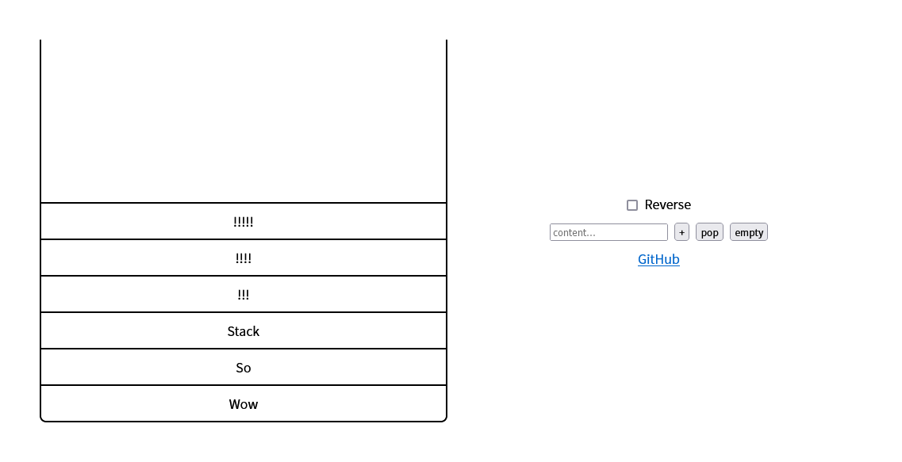

# stack-visualiser
Simple stack visualizer.

## Feature
- Simple is the best: Push / Pop / Empty / Reversed Layout.
- Clean UI: Also support RWD.
- Content Editable: You can modify the content of items after you added them.
- Using with keyboard: (*Enter*: push / *Esc*: pop)